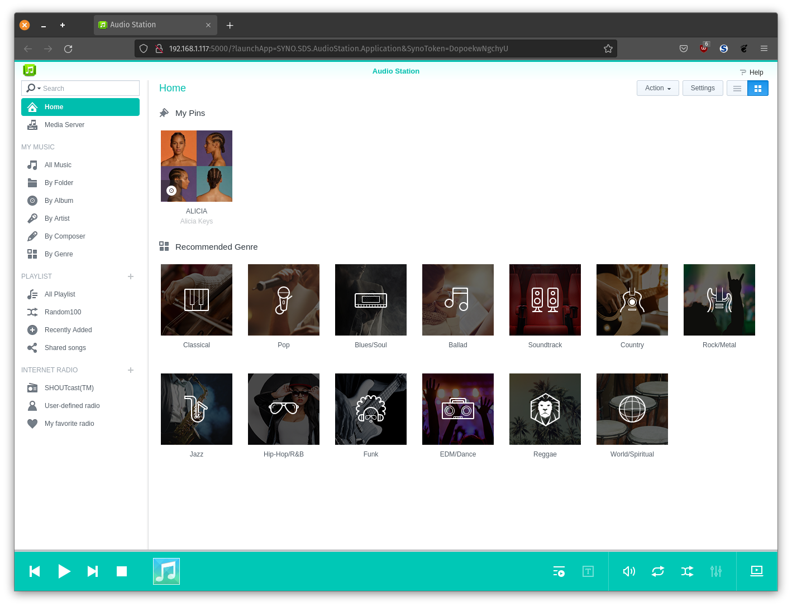

# Open Audio Server

Open Audio Server is a music streaming server compatible with [Audio Station](https://www.synology.com/en-us/dsm/feature/audio_station) by [Synology](www.synology.com).  Audio Station creates your own private service like Spotify for you and your family.  You store your music files on your Synology NAS and access them in web browsers on your computers or use the Synology DS Audio app available on Android and iOS marketplaces.

Open Audio Server lets you use any computer to store and stream your music library when your Synology NAS is unavailable.  It should run on SBC ARM devices with as little as 256 MB of memory but the smallest device it has been tested on is a Raspberry Pi 2 Model B with 1024 MB of memory.

This project is not associated with Synology in any way.

### Compatibility 

Aside from user accounts the goal is for complete compatibility.  Although incomplete the server is functional:

    [✓] Home screen pinned media and any "default" genres within your library
    [✓] Browsing, pinning, rating and editing songs and saving tracks to playlists
    [✓] Browsing and pinning artists, albums, composers and genres and saving to playlists
    [✓] Browsing, adding, editing, deleting and playing ShoutCast and added radio stations  
    [✓] Playing, creating, browsing, editing, reordering and deleting playlists   
    [✓] Playing, browsing and deleting music in playing queues
    [✓] Pagination, sorting, toggling columns of library items
    [✓] Detecting and selecting USB audio devices  
    [✓] Remote playback using server's default audio
    [✓] Remote volume control of server's default audio
    [✓] CSS themes for dark-mode web browser interface
    [✓] Android app compatibility  
    [✓] iPhone app compatibility  
    [ ] Searching for DLNA servers on network  
    [ ] Browsing DLNA servers (under "Media Server")  
    [ ] Broadcasting as DLNA server
    [ ] Broadcasting as iTunes server
    [ ] Song downloading on browser interface
    [ ] Shuffling, repeating and reorganizing music in playing queues
    [ ] Changing song cover images  
    [ ] Downloading song lyrics  
    [ ] Calculating genre, artist, album ratings by song ratings
    [ ] Saving changes to settings and 
    [ ] Whatever Amazon Alexa Service does
    [ ] Work out which "synoman" files can be deleted  
    [ ] Add support for serving images etc embedded in themes

## Installing Open Audio Server

First make sure you install NodeJS at least the "lts" version, then download the project from Github:

    $ git clone https://github.com/openaudioserver/open-audio-server

Change into the Open Audio Server directory:

    $ cd open-audio-server

The MUSIC_PATH setting should be the root of your music library where all your artist folders are:

    $ export MUSIC_PATH=/path/to/music

The CACHE_PATH setting is a folder for storing some JSON files containing your song index, ratings, etc:

    $ export CACHE_PATH=/path/to/cache

The SYNOMAN_PATH setting is where you optionally-copied Synology's files to use Audio Station in web browsers (details further down):

    $ export SYNOMAN_PATH=/path/to/synoman

The DSAUDIO_HTML_PATH setting is where you optionally-saved the HTML for Audio Station's web interface:

    $ export DSAUDIO_HTML_PATH=/path/to/dsaudio.html

The HOST is the network interface to listen on, probably your WIFI IP address.  If you do not specify it the server will only be accessible on your computer at `http://localhost:5000`.  If you specify your IP address (or `0.0.0.0` for all network connections) the DS Audio mobile apps and web browsers will be able to access your library at your IP address:

    $ export HOST=0.0.0.0

The PORT is a number that divides your IP address into thousands of different addresses, like adding apartment numbers to a building address, so all the different software on your computer can share the one IP address.  Generally a value higher than 1024 is recommended.  Open Audio Server uses port 5000 to match Synology DSM's default settings.

    $ export PORT=5000

The GZIP setting will compress your song and any other date very effectively, 1000 songs requires very roughly 500 kilobytes of JSON data that GZIP can compress to 50 kilobytes.  The reduction in file size means your library reads and updates much faster if it is a very large library on slow storage.

    $ export GZIP=true

The next line installs dependencies for the project.  These packages are specified  within "package.json" in the root of the project.  

    $ npm install

Start the server

    $ node server.js 

If you are going to be using remote playback you might need to install the `sox` and `libsox-fmt-all` packages:

    $ sudo apt-get install -y sox libsox-fmt-all build-essential

### Running as a service

I use "PM2" to run as a service:

    $ npm install -g pm2

Start the server with nothing being logged to disk:

    $ pm2 start server.js --name open-audio-server -o /dev/null -e /dev/null -l /dev/null

Set the server to run on startup, this will give you a command you have to run:

    $ pm2 startup
    
And then save your settings:

    $ pm2 save

### Issues and contributions

If Open Audio Server is not working for you create an issue to explore why.  If you can help someone unpack or resolve their problem post a reply on their issue.  There is probably compatibility issues, errors, bugs, and a long list of missing features too.  If you would like to help improve this pull requests are welcome.  Code contributions will be donated to the project and inherit its MIT license and a CONTRIBUTORS.md can be started.

## Scanning your library

The scanner will run automatically the first time you start the server.  The next time you start the server it will refer to a saved copy of your music index in your CACHE_PATH.  You can manually update your music library by going to `http://YOUR_SERVER_ADDRESS/scan` in a browser tab.

## Setting up the mobile apps

DS Audio mobile and television apps can be downloaded from the App Store, Play Store, Amazon App Store, and Android apps are also distributed on the Synology website (select NAS DS920):

    https://www.synology.com/en-us/support/download

When you open the apps, instead of the Synology server address you enter your computer's IP address on your home network.  There are no "user accounts" so it doesn't matter what you put in the username and password field.

## Optionally setting up the web interface

If you would like to use the web interface from Synology you will need to copy some files from your NAS.  These files cannot be distributed with the Open Audio Server project because they are copyright Synology.

The folder we are copying is `/usr/syno/synoman`, within it is the HTML, CSS and JavaScript files for the DS Audio web interface, along with Synology's various libraries for DSM that DS Audio depends on.  To use "scp" you may need to temporarily enable SSH in your Synology under Control panel -> Terminal & SNMP.

    $ scp -r administrator@1.2.3.4:/usr/syno/synoman/ /some/where

Update our configuration variable for SYNOMAN_PATH:

    $ export SYNOMAN_PATH=/some/where

Finally, you will need to open DS Audio in your web browser, you can do this by right clicking the icon in DSM and selecting launch in new window.  Once open find your browser setting to "View source" and save all the text into `dsaudio.html`.

    1) Open real `Audio Station` on a Synology or Xpenology occupying a full browser-tab
    2) View the page source in Firefox, Safari, Chrome or web browser
    3) Save the HTML text as `dsaudio.html`

Update our configuration variable for SYNOMAN_PATH:

    $ export DSAUDIO_HTML_PATH=/path/to/your/dsaudio.html

Once you have set up the HTML page and "synoman" folder you can open the web app in your browser:

    http://localhost:5000/

## Themes and dark mode

Open Audio Server supports CSS themes you can configure before starting the server.  Currently the theme must be a CSS file.  At the moment this is only useful for "dark mode" because someone already [created a dark theme](https://github.com/slserpent/dsm-dark-theme):

    $ git clone https://github.com/slserpent/dsm-dark-theme/

Configure the THEME_PATH with the theme's CSS file:

    $ export THEME_PATH=/path/to/slserpent/dsm-dark-theme/audiostation-dark.css

Start the NodeJS server:

    $ node server.js

## License

MIT